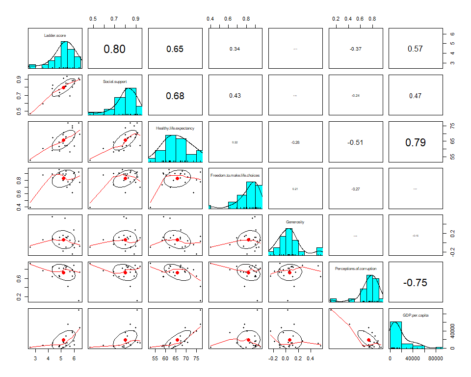
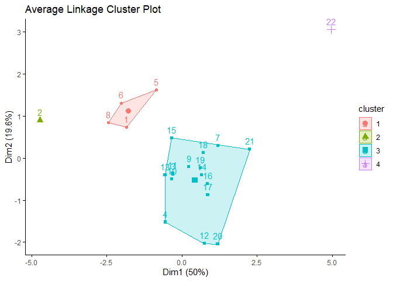

Cluster Analysis of Countries in Asia
================

### Introducton

The World Happiness Report is an annual report from the Sustainable Development Solutions Network that studies the quality of lives in over 150 countries using survey responses from the Gallup World Poll. The focus of the 2020 report was social environments for happiness. In this project, I will use the data set from the 2020 World Happiness Report to explore 22 countries in Asia and find similarities and dissimilarities between them by looking at each country's ladder score, social support, healthy life expectancy, freedom to make life choices, generosity, perceptions of corruption, and GDP per capita. I will use two clustering methods, k-means and hierarchical clustering, and silhouette analysis to validate each clustering method.

The countries and regions that will be analyzed are:

    ##                      Country             Region
    ## 1   Taiwan Province of China          East Asia
    ## 2                  Singapore     Southeast Asia
    ## 3                Philippines     Southeast Asia
    ## 4                   Thailand     Southeast Asia
    ## 5                South Korea          East Asia
    ## 6                      Japan          East Asia
    ## 7                   Pakistan         South Asia
    ## 8  Hong Kong S.A.R. of China          East Asia
    ## 9                   Mongolia          East Asia
    ## 10                  Malaysia     Southeast Asia
    ## 11                   Vietnam     Southeast Asia
    ## 12                 Indonesia     Southeast Asia
    ## 13                  Maldives         South Asia
    ## 14                     Nepal         South Asia
    ## 15                     China          East Asia
    ## 16                      Laos     Southeast Asia
    ## 17                  Cambodia     Southeast Asia
    ## 18                Bangladesh         South Asia
    ## 19                 Sri Lanka         South Asia
    ## 20                   Myanmar     Southeast Asia
    ## 21                     India         South Asia
    ## 22               Afghanistan         South Asia

### Exploratory Data Analysis

##### Correlation Matrix

-   The distributions of ladder score, social support, freedom to make life choices, and perceptions of corruption are left-skewed.
-   The distributions of generosity and GDP per capita are right-skewed.
-   The distrubtion of healthy life expectancy is approximately symmetric.
-   There is a strong positive correlation between:
    -   Ladder score and Social support
    -   Healthy life expectancy and GDP per capita
-   There is a strong negative correlation between:
    + Perceptions of corruption and GDP per capita
-   There is a moderate positive correlation between:
    + Ladder score and Healthy life expectancy
    + Social support and Healthy life expectancy
-   Countries with higher GDP per capita have tend to have lower perceptions of corruption, and higher healthy life expectancy, social support, and ladder score.

##### Country and Regional Comparison

-   Countries in East Asia tend to have high ladder score, healthy life expectancy, and GDP per capita, and low generosity.
-   Countries in South Asia tend to have low ladder score, social support, healthy life expectancy, and GDP per capita.
-   Countries in Southeast Asia tend to have high freedom to make life choices and generosity.

-   South Asia has the lowest median social support, ladder score, and GDP per capita.
-   East Asia has the highest median social support, ladder score, GDP per capita, and healthy life expectancy.
-   Southeast Asia has the lowest median healthy life expectancy and highest median perception of corruption.
-   Southeast Asia has an outlier with very high GDP per capita and healthy life expectancy, and very low perceptions of corruption (Singapore).
-   East Asia has an outlier with low perceptions of government (Hong Kong).

### Cluster Analysis

Do these countries naturally fall into different groups? In this section, we will use the help of clustering, an unsupervised learning method that groups objects based on similarities, to find groups of countries, where the countries within groups are similar. I will use two approaches to clustering: Hierarchical clustering and K-Means clustering.
First, how do we identify these groups? A way to measure similarties between objects is by measuring mathematical distances between them. One common distance measurement is the Euclidean distance.

#### Euclidean distance

We will use the Euclidean distance to find the countries most similar to each other and group them together.
The equation for Euclidean distance in n dimensions is: ^2+(d_{2,A}-d_{2,B})^2+...+(d_{n,A}-d_{n,B})^2}")

After standardizing the data with  the Euclidean distance matrix is:

    ##        1     2     3     4     5     6     7     8     9    10    11    12    13    14    15    16    17    18    19    20    21
    ## 2   4.32                                                                  
    ## 3   2.54  5.67                                                            
    ## 4   2.70  5.80  2.33                                                      
    ## 5   1.85  5.27  3.30  3.23                                                
    ## 6   1.54  4.21  2.77  3.43  2.15                                          
    ## 7   3.40  6.52  2.25  3.06  3.16  3.90                                    
    ## 8   2.62  2.85  4.02  3.75  2.85  2.56  4.41                              
    ## 9   2.64  6.30  2.38  2.16  2.68  3.35  2.49  4.05                        
    ## 10  2.24  5.36  1.93  1.37  2.64  2.71  2.54  3.20  2.18                  
    ## 11  2.66  5.73  1.25  2.17  3.11  2.47  2.76  3.79  2.50  1.57            
    ## 12  4.11  6.70  3.45  1.89  4.18  4.87  3.07  4.51  2.82  2.37  3.39      
    ## 13  2.33  5.55  2.02  1.68  2.58  2.38  3.05  3.30  1.87  1.35  1.25  2.98
    ## 14  3.09  6.05  2.00  2.06  2.93  3.43  1.56  3.70  1.86  1.66  1.95  2.18  1.87
    ## 15  2.51  5.44  1.66  2.76  2.73  2.02  2.75  3.47  2.81  1.76  0.93  3.85  1.64  2.17
    ## 16  3.71  6.00  2.08  2.83  3.91  3.94  1.81  4.10  2.90  2.20  2.32  2.70  2.75  1.42  2.45
    ## 17  3.58  6.42  1.77  2.33  3.82  3.73  2.22  4.41  2.68  1.71  1.56  2.61  2.15  1.52  1.93  1.30
    ## 18  3.55  5.95  2.07  3.09  3.47  3.38  1.97  3.92  3.19  2.18  1.89  3.36  2.55  1.63  1.68  1.27  1.42
    ## 19  3.19  6.21  2.44  2.25  2.97  3.23  2.63  3.79  2.10  1.48  1.73  2.63  1.40  1.45  1.84  2.17  1.56  2.00
    ## 20  4.98  6.72  4.01  3.23  5.02  5.48  3.46  4.71  3.67  3.26  3.98  1.82  3.75  2.58  4.31  2.44  2.94  3.35  3.09
    ## 21  4.95  7.24  3.67  4.18  4.56  4.90  2.77  5.11  4.08  3.24  3.40  3.68  3.80  2.66  3.18  2.15  2.28  1.94  2.59  3.31
    ## 22  7.37 10.11  6.76  7.32  6.24  7.46  5.02  7.80  6.08  6.52  6.73  6.67  6.78  5.63  6.35  5.74  5.98  5.59  5.67  6.46  4.41
    

-   It appears that country 2 (Singapore) and country 22 (Afghanistan) are the most dissimilar to each other.
-   Country 15 (China) and country 11 (Vietnam) are the most similar to each other.

How do we choose the optimal number of clusters?

#### Elbow method

Our objective is to reduce within cluster variability, so similar objects are grouped together, and increase between cluster variation, so dissimilar objects are far apart. The WSS (within group sum of squares), which measures within cluster variation, is given by the following equation: 

In the WSS plot, the number of clusters lies on the x-axis and the WSS lies on the y-axis. A high WSS value means that there is high variation within clusters, and vice versa. We see that the drop in WSS is large after 1, 2, and 3 clusters. But, after 4 clusters, the drop in WSS is small. Thus, the optimal number of clusters is k=4, the elbow of the curve.

### K-Means Clustering

The k-means algorithm goes like this:
1. Randomly assign a number, from 1 to K, to each of the observations, which serve as initial cluster assignments for the observations.
2. Iterate until the cluster assignments stop changing: 

(a) For each of the K clusters, compute the cluster centroid. 

(b) Assign each observation to the cluster whose centroid is closest (defined using the Euclidean distance).

##### Cluster Memberships and Results

The results of k-means clustering are:

    ## Cluster 1: Indonesia, Myanmar

    ## Cluster 2: Afghanistan

    ## Cluster 3: Philippines, Thailand, Pakistan, Mongolia, Malaysia, Vietnam, Maldives, Nepal, China, Laos, Cambodia, Bangladesh, Sri Lanka, India

    ## Cluster 4: Taiwan Province of China, Singapore, South Korea, Japan, Hong Kong S.A.R. of China

The cluster plot plots the k-means clusters and the first two principle componenets (dimensions 1 and 2) in a scatter plot.

-   There are no overlaps between clusters.
-   There are a lot of separation between cluster 2 and other clusters.
-   There is less separation between clusters 1, 3, and 4.
-   The first two components explain about 70% of the point variability.

<!-- -->

    ## K-means clustering with 4 clusters of sizes 2, 1, 14, 5
    ## 
    ## Cluster means:
    ##   Ladder.score Social.support Healthy.life.expectancy Freedom.to.make.life.choices Generosity Perceptions.of.corruption GDP.per.capita
    ## 1  -0.42983319   -0.007501657              -0.8032022                    0.4365738  2.4521472                 0.1638219     -0.4939874
    ## 2  -2.89960689   -2.952955570              -2.0404477                   -3.3305675 -0.8208415                 1.1331352     -0.8168611
    ## 3  -0.06071938   -0.012160120              -0.2177161                    0.3036419 -0.1026349                 0.2765047     -0.4285809
    ## 4   0.92186891    0.627640113               1.3389754                   -0.3587134 -0.5293129                -1.0663690      1.5609936

    ## Within cluster sum of squares by cluster:
    ## [1]  1.647565  0.000000 33.971894 20.868810
    ##  (between_SS / total_SS =  61.6 %)

-   Cluster 1 has 2 countries with a very small within cluster sum of squares (within cluster variablity).
-   Cluster 2 has 1 country.
-   Cluster 3, which has 14 countries, has the highest within cluster variability.
-   Cluster 4, which has 5 countries, has the second highest within cluster variability.
-   The ratio of between cluster sum of squares and total sum of squares is 61.6%, which is a fairly good fit.

The standardized averages for the 4 clusters are:

Freedom to make life choices, social support, and ladder score have large average differences between clusters. These variables seem to contribute the most to cluster formation.

Recall that the cluster memberships are:

Cluster 1: Indonesia, Myanmar 

Cluster 2: Afghanistan 

Cluster 3: Philippines, Thailand, Pakistan, Mongolia, Malaysia, Vietnam, Maldives, Nepal, China, Laos, Cambodia, Bangladesh, Sri Lanka, India 

Cluster 4: Taiwan Province of China, Singapore, South Korea, Japan, Hong Kong S.A.R. of China 

Relative to other clusters:

Cluster 1 is characterized by 

-   Very High: generosity 
-   High: freedom to make life choices 
-   Medium: GDP per capita, perceptions of corruption, generosity, healthy life expectancy, social support, ladder score  

Cluster 2 is characterized by  

-   High: perceptions of corruption
-   Low: GDP per capita, generosity
-   Very Low: freedom to make life choices, healthy life expectancy, social support, ladder score

Cluster 3 is characterized by

-   High: freedom to make life choices
-   Medium: GDP per capita, perceptions of corruption, generosity, healthy life expectancy, social support, ladder score

Cluster 4 is characterized by

-   Very High: GDP per capita, healthy life expectancy
-   High: social support, ladder score
-   Medium: freedom to make life choices
-   Low: generosity
-   Very Low: perceptions of corruption

#### Silhouette Plot

We use the silhouette plot to see how well each country lies within its cluster. The silhouette width measures how close each observation in one cluster is relative to other clusters. A high silhouette width indicates that the observation is well-clustered, while values near 0 indicate that the observation is matched between two clusters, and negative values indicate that the observation is in the wrong cluster. 

-   Most countries seem to be fairly well-clustered.
-   Country 4 (Thailand) in cluster 3 and Country 5 (South Korea) in cluster 4 have very low silhouette widths.

### Hierarchical Clustering

Hiearchical clustering maps groups into a hierarchy, called a dendrogram.
The hiearchical clustering algorithm goes like this:
1. Begin with n observations and a measure (e.g. Euclidean distance) of all the pairwise dissimilarities. Treat each observation as its own cluster.
2.
  (a) Examine all pairwise inter-cluster dissimilarities among the i clusters and identify the pair of clusters that are most similar. Join these two clusters. The dissimilarity between these two clusters indicates their height in the dendrogram.
  
  (b) Compute the new pairwise inter-cluster dissimilarities among the remaining clusters.
For hierarchical clustering, we use a distance function between clusters, called the linkage function.
Different types of linkages:

1.  Complete (Maximal intercluster dissimilarity): computes all pairwise dissimilarities between observations in cluster 1 and observations in cluster 2, and records the largest of these dissimilarities.

 = \max\limits_{x_1\in{c_1,x_2\in{c_2}}} D(x_1,x_2)")

2.  Average (Mean intercluster dissimilarity): computes all pairwise dissimilarities between observations in cluster 1 and observations in cluster 2, and records the average of these dissimilarities.

 = \frac{1}{|{c_1|}}\frac{1}{|c_2|}\sum\limits_{x_1\in{c_1}}\sum\limits_{x_2\in{c_2}}D(x_1,x_2)")

#### Complete Linkage

The dendrogram below shows the hierarchy of the clusters using complete linkage.

-   Cluster 1 has 16 countries.
-   Cluster 2 has 2 countries.
-   Cluster 3 has 3 countries.
-   Cluster 4 has 1 country.
-   There are a lot of separation between cluster 4 and other clusters.
-   There is less separation between clusters 1, 2, and 3.
-   The variability within cluster 1 appears to be large.

#### Silhouette Plot

-   Most countries seem to be fairly well-clustered.
-   Country 16 (Laos) seems to be an outlier for cluster 1.
-   Country 21 (India) seems to be an outlier for cluster 3.

#### Average Linkage

The dendrogram below shows the hierarchy of the clusters using average linkage.

-   Cluster 1 has 4 countries.
-   Cluster 2 has 1 country.
-   Cluster 3 has 16 countries.
-   Cluster 4 has 1 country.
-   The variability between clusters using average linkage appears to be larger than that of complete linkage.

#### Silhouette Plot

-   Most countries seem to be fairly well-clustered.
-   Country 8 (Hong Kong) in cluster 1 has a very low silhouette width.

### Discussion

The average silhouette widths for k-means, complete linkage, and average linkage are 0.26, 0.23, and 0.27, respectively. In complete linkage, the separation between clusters is smaller than that of k-means and average linkage, and two countries did not fit well into their clusters. Thus, k-means and average linkage methods seem to give a better fit than complete linkage.
Comparing k-means, complete linkage, and average linkage, all methods matched Afghanistan to be in its own cluster. However, there are some differences in the cluster memberships for each method. For instance, in k-means and complete linkage, Indonesia and Myanmar are not in the same cluster as most South Asian and Southeast Asian countries, whereas Indonesia and Myanmar are grouped in the same cluster as those countries in average linkage. Another difference is that in average linkage, Singapore is in its own cluster, while in k-means and complete linkage, Singapore is grouped with other East Asian countries.

Both k-means and hierarchical clustering produced fairly good clustering results. K-means has an advantage when using large data sets and interpreting clustering results. The drawbacks of k-means are that it requires numerical data and the number of clusters to be specified at the beginning. Also, since initial cluster assignments are randomized at the beginning, clustering results are different when you run the algorithm again.
On the other hand, hierarchical clustering works on both numerical and categorical data, does not require the number of clusters to be specified first, and gives the same results every time you run the algorithm. It also produces dendrograms, which are useful in helping you understand the structure of the data and pick the number of clusters. However, some disadvantages are that for large data, it is not as efficient as k-means, and determining the number of clusters from the dendrogram becomes difficult.
